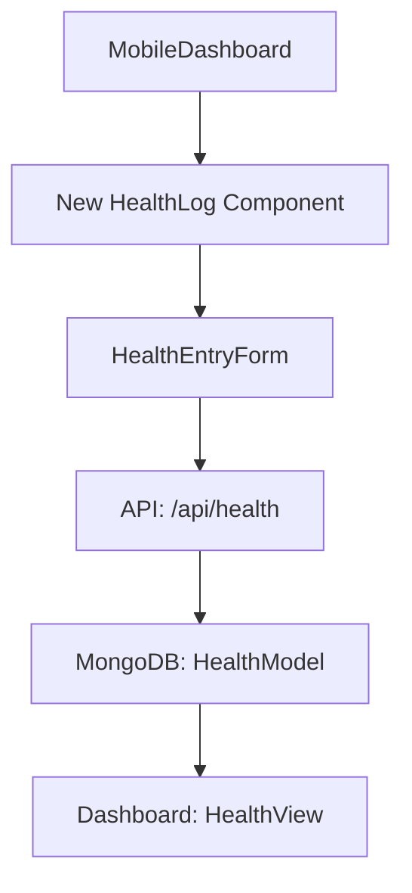
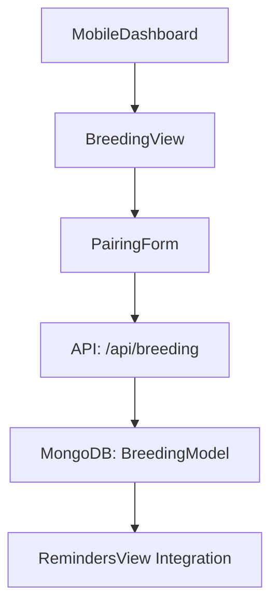

# Moltly App Improvement Suggestions

## Current Features Analysis
From the codebase:
- **Core Logging**: Supports molt, feeding, and water entries with details like specimen, species, date, stage, sizes, environmental data, notes, reminders, and attachments.
- **Views**: Overview dashboard, activity log, specimens profiles, reminders, and research notebook for organized notes.
- **Data Management**: Local storage, sync mode, export/import, notifications.
- **UI/UX**: Mobile-friendly with search, filters, editing, and basic stats.

**Potential Gaps**:
- No dedicated tracking for breeding, health issues, weight/behavior, or inventory (e.g., enclosures, substrates).
- Limited analytics (e.g., molt predictions, growth charts).
- No community features or species database.
- Basic notebook lacks advanced organization (e.g., templates, search across stacks).

## Prioritized Feature Suggestions
1. **Health Tracking** (High Priority): Add logs for weight, behavior, medical issues.
2. **Breeding Logs** (High): Track pairings, egg sacs, slings.
3. **Inventory Management** (Medium): Manage enclosures, supplies with low-stock alerts.
4. **Advanced Analytics** (Medium): Predict molt cycles, generate growth charts.
5. **Species Database** (Low): Built-in info on tarantula species.

## Architecture Diagrams

### For Health Tracking:

### For Breeding Logs:

## Actionable Implementation Plan
1. Update models (e.g., add HealthEntry.ts, BreedingEntry.ts).
2. Create new API routes (e.g., app/api/health/route.ts).
3. Add components (e.g., HealthView.tsx, integrate into MobileDashboard.tsx).
4. Extend dashboard with new tabs/views.
5. Update local storage and sync logic.
6. Test with sample data and notifications.
